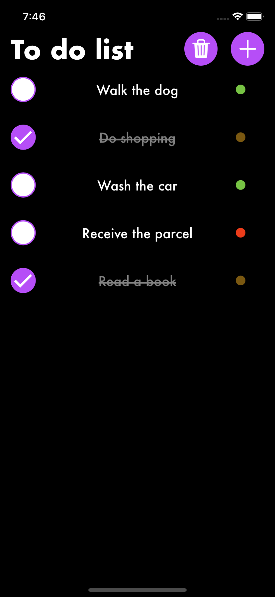
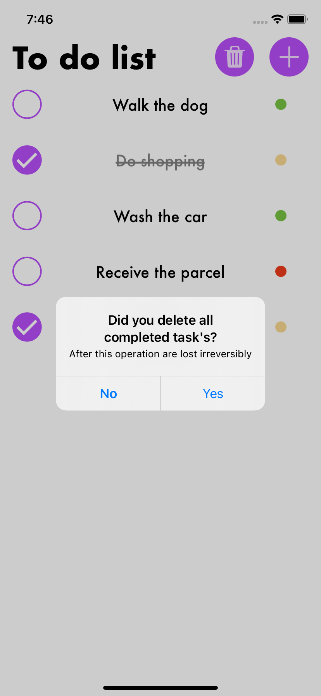
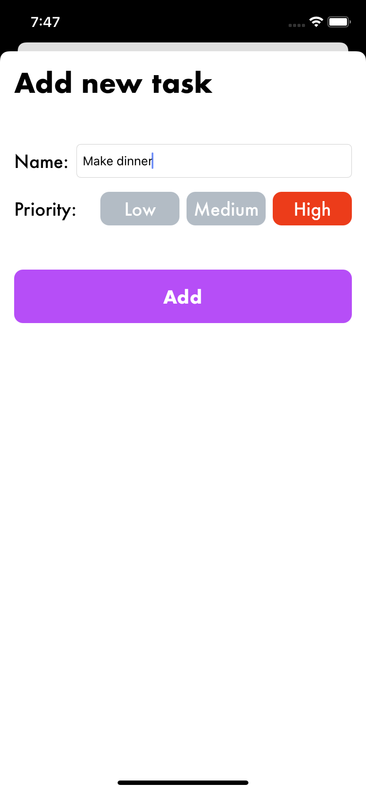
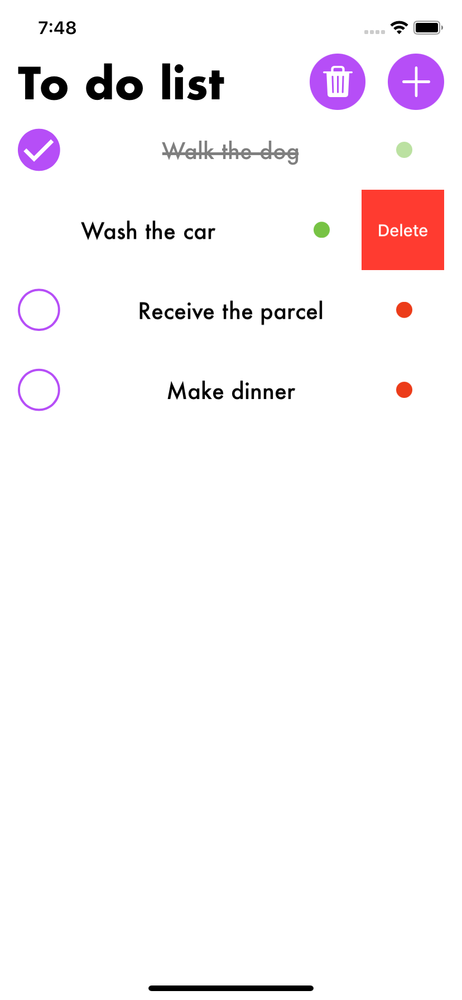
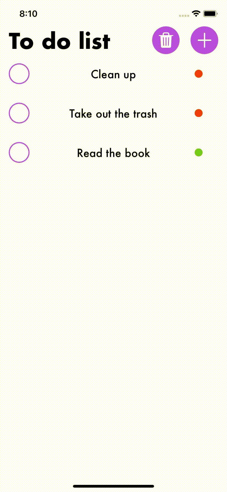

# ToDoList-iOS-App

## Runtime environment
   

## Technologies
<a href="https://developer.apple.com/swift/">  </a>
<a href="https://developer.apple.com/support/xcode/">  </a>
<a href="https://developer.apple.com/documentation/coredata">  </a>
<a href="https://cocoapods.org">  </a>


## Table of contents
* [General info](#general-info)
* [Functionality](#functionality)
* [How to build](#how-to-build)
* [Demo](#demo)
* [Sources](#sources)
* [Contact](#contact)

## General info

Simple single view iOS app to learn CoreData. This is example app of using Core Data to store Tasks to do. Unit tests with Core Data are implemented too.

## Functionality

- adding new tasks
- marking completed tasks
- deleting all completed tasks
- deleting individual tasks
- color priorities

<p align="center"> 
		               
                   
                    </p>

## How to build

In app main folder run this command:
```
pod install
```
After installing dependencies, you can run the project(`CalculatorForMechanics.xcworkspace`).

## Demo
<p align="center">  </p>

## Sources
- animated checkbox: https://github.com/swifty-iOS/RadioCheckboxButton

## Contact
<a href="https://www.linkedin.com/in/michał-nowak-53075a17a/">  </a>
<a href="https://twitter.com/mnowak061">  </a>
<a href="https://www.kaggle.com/mnowak061">  </a>
